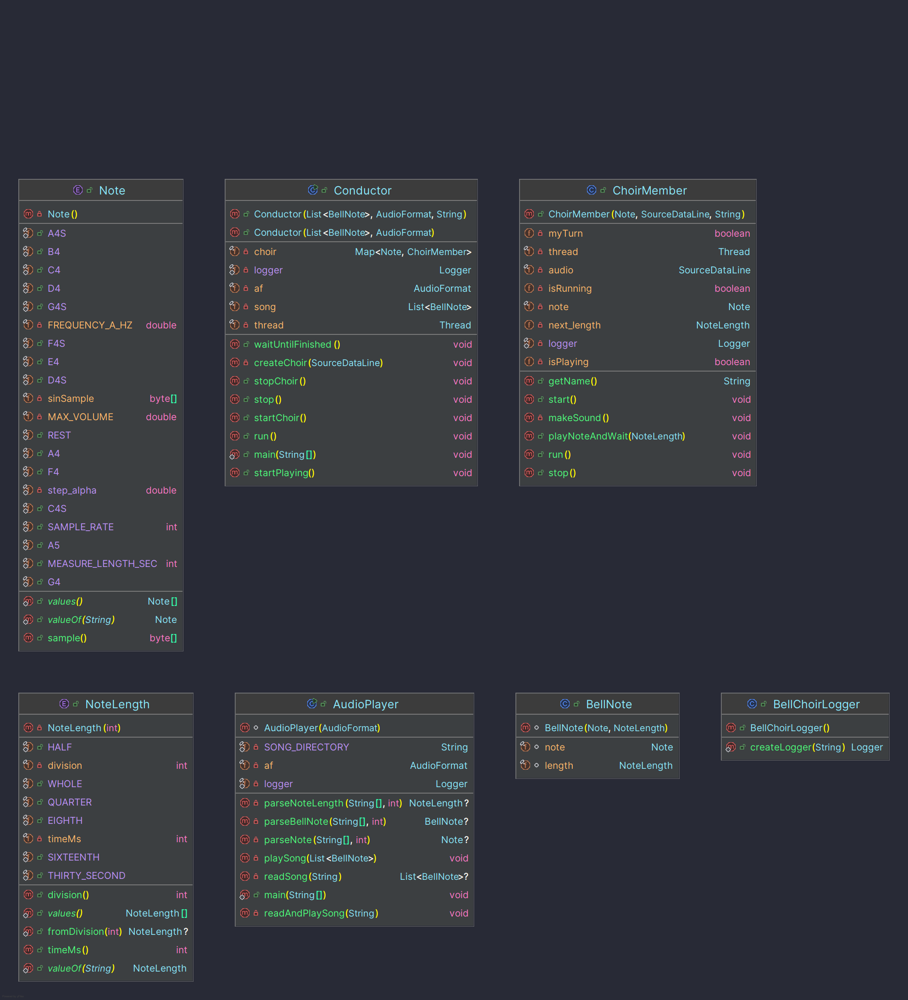

# Bell Choir

## Overview

This multithreaded Java project simulates a real Bell Choir.
This program is controlled by the main entry point `AudioPlayer`.
The song is played by a central unit, called a `Conductor`, which creates the necessary `ChoirMembers`.
Each `ChoirMember` is assigned only $1$ note to play.

The program reads a song from a file, parses it into a sequence of notes, and plays it using synchronized thread
communication.

## Features

* Multithreaded Audio Playback using `SourceDataLine`
* Central Control via `AudioPlayer` Thread
* Thread-safe communication through `wait()` and `notify()`
* File-based song input

## How to Run

The simplest way to run the program is to use ANT. Run:
```bash
ant run
``` 
at the project level to run the default song: "Mary had A Little Lamb". 
To easily change the song played, change the ant parameter: Song.
The parameter should be the filename of the song to be played.
This program is built under the assumption all songs will be in the `res/songs` directory.

For example, the song "Happy Birthday" can be played using:
```bash 
ant run -Dsong="HappyBirthday.txt"
```

## Structure

This is shown in the UML for this project, located [here](docs/project_uml.png) in the docs directory.



* AudioPlayer
    * Entry point of the program
        * Uses main method: accepts only $1$ Argument (song's filename)
    * Reads song files and initializes playback
    * Creates the `Conductor`
* Conductor
    * Controls the flow of the song
    * Assigns turns to `ChoirMember` threads
    * Ensures notes are played in sequence
* ChoirMember
    * Represents a musician responsible for a single note
    * Runs in its own thread
    * Waits until signaled by the `Conductor` to play
* BellNote
    * Combines a Note and a NoteLength
* Note / NoteLength
    * Represents the pitch and duration of notes

## Challenges Faced

One of the biggest challenges was converting the single threaded program into a safe, multithreaded system.
Making sure that this program didn't just play the notes from a for loop, but was actually multithreaded.
This lead to some various challenges.
Firstly, making sure that each `ChoirMember` got their time to play their note without race conditions.
The first attempt at this was full of race conditions, but adding a blocking mechanic to the `ChoirMember` made sure
that the `Conductor` had to wait till the first member was finished before cueing the next.
This was achieved through careful use of `wait()`, `notify()`, and the keyword `synchronized`.

## Future Work
This project could be expanded in various ways.
Firstly, due to time constraints the testing for classes is limited. 
Using a testing process, like Junit, will help verify this program works as intended.

